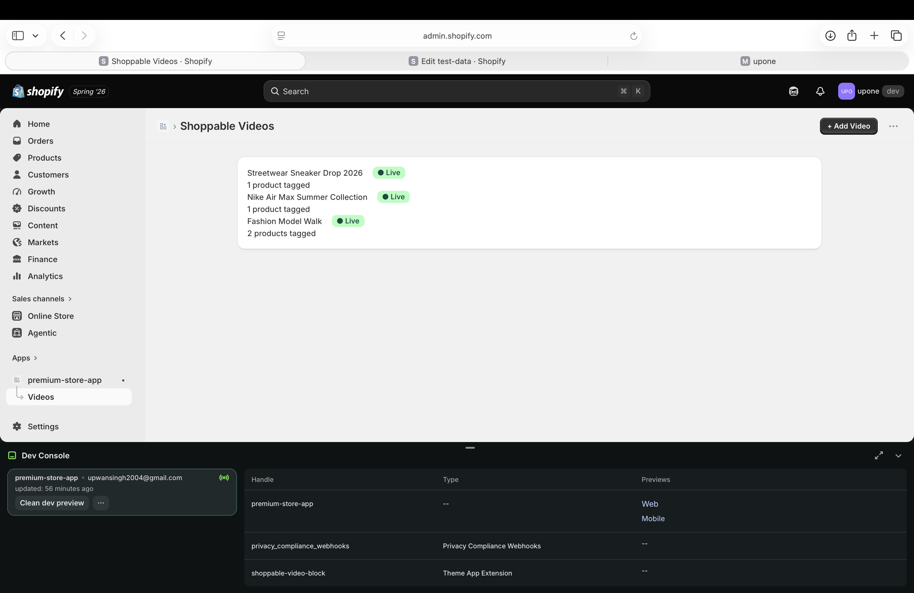
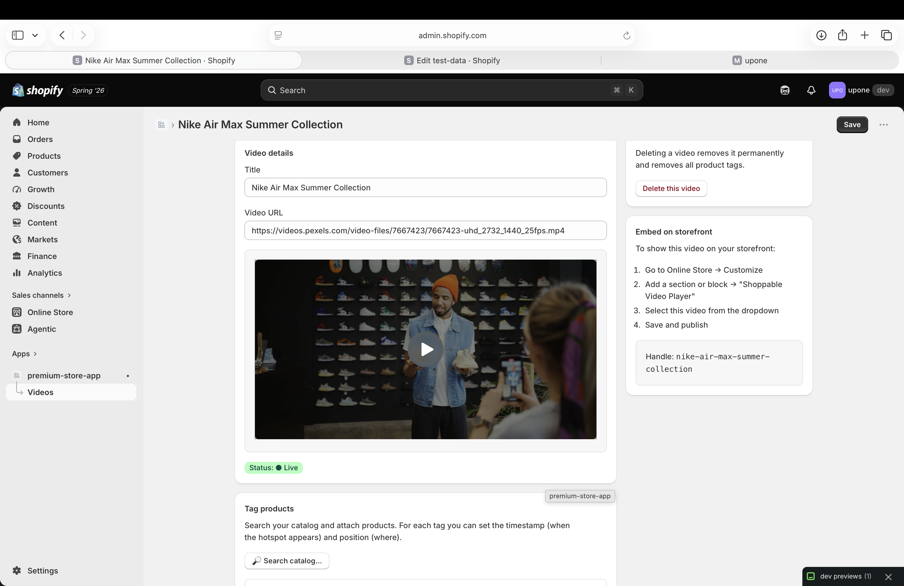
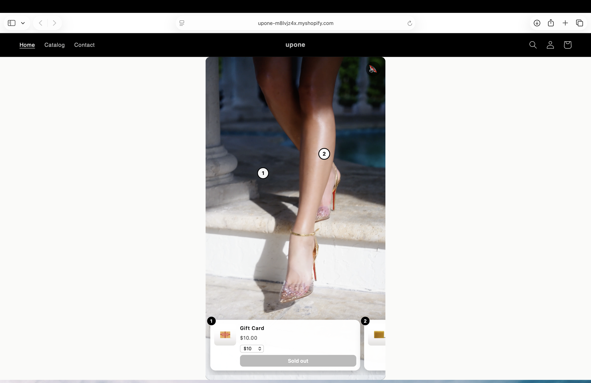
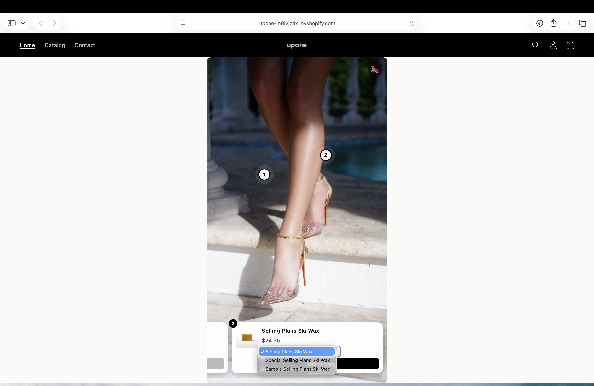

# Shoppable Videos — Shopify App

A generic, end-to-end Shopify app that lets merchants attach products to videos and render a shoppable video player on their storefront. Shoppers watch, tap a tagged product hotspot, and add it to cart without leaving the video.

---

## Table of Contents

- [Screenshots](#screenshots)
- [Setup & Run](#setup--run)
- [Verify It Works — Admin + Storefront](#verify-it-works--admin--storefront)
- [Data Model](#data-model)
- [Install / Uninstall Lifecycle](#install--uninstall-lifecycle)
- [Scopes & Permissions](#scopes--permissions)
- [Stack Deviations](#stack-deviations)
- [Known Edge Cases & Failure Modes](#known-edge-cases--failure-modes)
- [What I'd Do With More Time](#what-id-do-with-more-time)

---

## Screenshots

| Admin — videos list | Admin — video editor |
|---|---|
|  |  |

| Storefront — hotspots + product card | Storefront — variant selector |
|---|---|
|  |  |

---

## Setup & Run

### Prerequisites
- Node.js ≥ 20.19
- A [Shopify Partners](https://partners.shopify.com/) account
- A development store

### Steps

```bash
# 1. Clone & install
git clone <your-repo> && cd <repo>
npm install

# 2. Link to your app (if not already linked)
#    The shopify.app.toml contains the client_id.
#    If you're starting fresh, run:
shopify app config link

# 3. Run against a dev store
shopify app dev
#    → Follow the OAuth install prompt, grant scopes
#    → The app loads embedded at the Preview URL printed in the terminal
```

The app uses SQLite (via Prisma) for session storage. On first run, Prisma auto-migrates.

**Environment variables:** for local development you do **not** need a `.env` — `shopify app dev` injects `SHOPIFY_API_KEY`, `SHOPIFY_API_SECRET`, `SCOPES`, and `SHOPIFY_APP_URL` automatically from your linked app and tunnel. For production/self-hosting (`npm run build && npm start`), copy `.env.example` to `.env` and fill it in. See [`.env.example`](.env.example).

---

## Verify It Works — Admin + Storefront

The app has two surfaces: the **embedded admin** (where a merchant manages videos) and the **storefront block** (what shoppers see). Here's how to open and check each after `shopify app dev` is running.

### A. The admin app

With `shopify app dev` running, press **`p`** in that terminal (or open the printed **Preview URL**). It opens the app **embedded inside Shopify admin** → **Shoppable Videos → Videos**.

1. **Add Video** → paste a hosted MP4 URL, give it a title.
   *(A verified portrait test clip: `https://videos.pexels.com/video-files/7667423/7667423-uhd_2732_1440_25fps.mp4`)*
2. **Tag products** → *Search catalog…* → pick one or more products. Each tag gets a timestamp (when the hotspot shows) and an on-screen position.
3. Set **Status → Live**, then **Save**. (Setting Live with zero tags is blocked with a toast.)
4. Copy the **Handle** shown in the *Embed on storefront* panel — you'll need it for the single-video block.

### B. The storefront block

The block doesn't appear on its own — it's placed once via the theme editor.

1. Shopify admin → **Online Store → Themes → Customize**.
2. On any page (Home is easiest): **Add section / Add block** → under **Apps**, pick one of:
   - **Shoppable Video Player** — one video; paste the **handle** from step A4 into the block settings.
   - **Shoppable Video Feed** — a vertical, TikTok-style feed that auto-renders **every Live video** (no handle needed).
3. **Save**, then **View your store**.
4. On the storefront: the video autoplays muted; tap a numbered **hotspot** → the product card shows → pick a **variant** → **Add to cart**. A confirmation toast fires and the cart count increments — no page reload.

### Quick reference

| What | Where |
|---|---|
| Admin app | `shopify app dev` terminal → press `p` (embeds in Shopify admin) |
| Storefront | Dev store → **Online Store → Themes → Customize** → add a *Shoppable Video* block → **View store** |
| Restart dev server | `npm run dev` (alias for `shopify app dev`) |

> See the [Screenshots](#screenshots) above for what each surface looks like.

---

## Data Model

### Entity Relationship

```
┌─────────────────────────────────────────────────────────┐
│                    Shopify Platform                      │
│                                                         │
│  ┌───────────────────────────────────────────────────┐  │
│  │  Metaobject: $app:shoppable_video                 │  │
│  │  (type app--<app_id>--shoppable_video)            │  │
│  │  (App-owned, shop-scoped, auto-deleted on         │  │
│  │   uninstall)                                      │  │
│  │                                                   │  │
│  │  Fields:                                          │  │
│  │  ├── title        (single_line_text_field)        │  │
│  │  ├── video_url    (single_line_text_field)        │  │
│  │  ├── status       (single_line_text_field)        │  │
│  │  │                "draft" | "live"                 │  │
│  │  └── tags         (json)                          │  │
│  │       └── Array of ProductTag objects:             │  │
│  │           ├── productId     (GID)                 │  │
│  │           ├── productHandle (string)              │  │
│  │           ├── title         (string, denormalized)│  │
│  │           ├── timestamp     (number, seconds)     │  │
│  │           ├── positionX     (number, 0-100 %)     │  │
│  │           └── positionY     (number, 0-100 %)     │  │
│  └───────────────────────────────────────────────────┘  │
│           │                                             │
│           │ references via productHandle                │
│           ▼                                             │
│  ┌──────────────────┐                                   │
│  │  Shopify Product  │  (Shopify's native entity)       │
│  │  (read via        │                                  │
│  │   all_products[]  │                                  │
│  │   or Admin API)   │                                  │
│  └──────────────────┘                                   │
│                                                         │
└─────────────────────────────────────────────────────────┘

┌─────────────────────────────────────────────────────────┐
│                   App's Own Database                     │
│                   (Prisma / SQLite)                      │
│                                                         │
│  ┌───────────────────────────────────────────────────┐  │
│  │  Session                                          │  │
│  │  (OAuth sessions only — no business data here)    │  │
│  │  ├── id, shop, state, accessToken, ...            │  │
│  └───────────────────────────────────────────────────┘  │
└─────────────────────────────────────────────────────────┘
```

### 1. Entities & Relationships

There is one core entity: **Shoppable Video**. It has a one-to-many relationship with **Product Tags** (embedded as a JSON array inside the metaobject). Each tag points at a Shopify Product.

**Trade-off: Embedding tags as JSON vs. separate metaobjects.**
I chose JSON embedding because:
- Tags have no independent lifecycle — they exist only within a video.
- It avoids N+1 queries on the storefront read path.
- A single metaobjectUpsert call atomically writes the video + all its tags.
- Downside: no direct Liquid iteration by product across videos. Acceptable for this use case.

### 2. The Product Reference

**Choice:** Each tag stores both `productId` (the Admin API GID like `gid://shopify/Product/123`) and `productHandle` (the URL-safe handle like `linen-shirt`).

**Why both?**
- `productId` is the stable, canonical identifier used by the Admin API, webhooks, and the Resource Picker. It is used for matching in the `products/delete` webhook.
- `productHandle` is needed on the storefront because Liquid's `all_products[handle]` is the only way to synchronously fetch product data in a theme block without external API calls.

**Failure modes:**
| Scenario | What happens | How the code handles it |
|---|---|---|
| Product deleted | The handle becomes a dangling reference | `products/delete` webhook fires → iterates all videos → removes matching tags. Storefront Liquid checks `if product != blank` and silently skips missing products. |
| Product handle changed | The old stored handle no longer resolves on the storefront (`all_products[handle]` returns blank) | Handled by the `products/update` webhook: it matches tags by the stable `productId` and rewrites the denormalized `productHandle` (and `title`) to the new value. This is exactly why we store the immutable `productId` alongside the handle. |
| Product unpublished from the Online Store channel | `all_products[handle]` returns blank even though the product still exists | Storefront Liquid skips it (`if product != blank`), so the hotspot silently disappears — no broken card. Re-publishing restores it. |
| Same product tagged twice | Duplicate hotspots appear at different timestamps | The editor's `handleAddProduct` function deduplicates by `productId` — a product can only be added once. |

### 3. Storage

| Data | Where | Why |
|---|---|---|
| Video metadata + tags | Shopify Metaobjects (`$app:shoppable_video`) | Shop-scoped by default. Auto-deleted on uninstall. No sync issues. Accessible from Liquid. |
| OAuth sessions | Prisma / SQLite (`Session` table) | **Justified exception.** The Shopify SDK (`@shopify/shopify-app-session-storage-prisma`) requires a database for session tokens. This is the only data in our DB. |

**On uninstall:**
- App-owned metaobjects are garbage-collected by Shopify automatically.
- The `app/uninstalled` webhook deletes all sessions for that shop from Prisma.
- Net result: zero data retention after uninstall.

### 4. Shop Scoping

Every metaobject is created under the `$app` namespace, which is inherently scoped to the installing shop. The Shopify platform guarantees that Shop A's metaobjects are invisible to Shop B. There is no shop identifier stored in the metaobject itself — Shopify's infrastructure handles isolation.

In the local database, sessions are keyed by `shop` domain and deleted per-shop on uninstall.

### 5. Storefront Read Path

```
Storefront Request
       │
       ▼
  Liquid Template (Theme App Block)
       │
       ├── shop.metaobjects["$app:shoppable_video"][handle]
       │     → Reads title, video_url, status, tags JSON
       │       ($app: is the reserved prefix for app-owned metaobjects —
       │        it resolves to app--<app_id>--shoppable_video without
       │        hardcoding the app id in the theme)
       │
       ├── all_products[tag.productHandle]
       │     → Reads product title, price, image, variant ID
       │
       └── Renders HTML + inline <script>
             → Hotspots appear/disappear based on video timestamp
             → Tapping a hotspot shows product card
             → "Add to cart" calls /cart/add.js (Shopify Cart AJAX API)
```

**Two storefront blocks** ship in the theme app extension (both `target: "section"`, so they drop onto any page):
- **Shoppable Video Player** — renders one video, chosen by `video_handle` in block settings.
- **Shoppable Video Feed** — a vertical, TikTok-style swipe feed that auto-renders **every Live video** by looping `shop.metaobjects["$app:shoppable_video"].values` (no handle to type). In-view video autoplays muted via `IntersectionObserver`; each item keeps its own hotspots + add-to-cart.

**Auth:** None needed. Metaobject access is set to `storefront = "public_read"` in `shopify.app.toml`. Liquid reads are server-side, pre-authenticated by Shopify's CDN.

**Caching:** Shopify's edge CDN caches Liquid-rendered pages. No proxy/API calls to our app server at render time — everything is resolved in Liquid.

---

## Install / Uninstall Lifecycle

### Install Flow
1. `shopify app dev` starts the OAuth flow.
2. The merchant grants scopes: `read_products`, `write_metaobjects`.
3. Shopify creates the app-owned `shoppable_video` metaobject definition from `shopify.app.toml` (its full type is `app--<app_id>--shoppable_video`; the code references it with the reserved prefix `$app:shoppable_video`).
4. The app loads embedded in the admin, authenticated via session tokens.

### Uninstall Flow
1. Merchant uninstalls from Settings → Apps.
2. `app/uninstalled` webhook fires → our handler deletes all sessions for that shop from Prisma.
3. Shopify auto-deletes all app-owned metaobjects (all videos + tags gone).
4. The theme block degrades gracefully: `shop.metaobjects["app--shoppable_video"]` returns blank → block renders nothing. No JS errors.

### Reinstall Flow
- Reinstalling triggers a fresh OAuth flow. A new session is created.
- Since metaobjects were deleted on uninstall, the merchant starts fresh with zero videos.
- **Why:** This follows naturally from using app-owned metaobjects. Shopify's lifecycle guarantees clean slate on reinstall. We document this to the merchant in the README/UI.

---

## Scopes & Permissions

Only two scopes are requested — verified to be the complete set the app actually exercises:

| Scope | Why |
|---|---|
| `read_products` | Search the product catalog in the Resource Picker; read product data in the `products/*` webhooks. |
| `write_metaobjects` | Create, update, and delete shoppable-video metaobject entries. |

**Deliberately NOT requested (least privilege — verified, not assumed):**
- **`write_metaobject_definitions`** — the metaobject *definition* is declared declaratively in `shopify.app.toml` and is read-only through the Admin API, so the app never mutates definitions at runtime. Confirmed that entry create/update/delete works with only the two scopes above.
- **`read_files` / `write_files`** — video hosting is paste-a-hosted-URL, so the Files API is not used. See [Stack Deviations](#stack-deviations).
- **`write_products`** — we never modify products, only read them.

**Token choice: Offline tokens.** We use offline access tokens because webhook handlers (like `products/delete`) need to make Admin API calls without a merchant actively using the app. Online tokens expire with the session and can't service background webhook work.

---

## Webhooks

| Topic | Handler | Purpose |
|---|---|---|
| `app/uninstalled` | Delete sessions from Prisma DB | Clean up auth data |
| `app/scopes_update` | Update session scopes | Keep session in sync |
| `products/delete` | Remove dangling product tags from all videos | Data integrity |
| `products/update` | Re-sync denormalized `productHandle`/`title` in tags when a product is renamed | Heals the handle-change failure mode (only writes back when a value changed → idempotent) |
| `customers/data_request` | Acknowledge (no customer data stored) | GDPR compliance |
| `customers/redact` | Acknowledge (no customer data stored) | GDPR compliance |
| `shop/redact` | Acknowledge (sessions already purged) | GDPR compliance |

All webhook handlers:
- Verify HMAC via `authenticate.webhook(request)` (handled by Shopify SDK).
- Return `200` immediately (the SDK handles this).
- Are idempotent — safe to run on retries.

---

## Known Edge Cases & Failure Modes

| Edge Case | Handling |
|---|---|
| Video set live with zero tags | The `Set Live` button checks tag count and shows a toast error: "Cannot set live: tag at least one product first." |
| Same product tagged twice | The Resource Picker handler deduplicates by `productId`. A product can only appear once per video. |
| Theme block placed with no video selected | In the theme editor (design mode), shows a placeholder message. On the live storefront, renders nothing. |
| Video selected but metaobject missing | In design mode, shows an error message. On live storefront, renders nothing. No JS errors. |
| Product deleted after tagging | `products/delete` webhook removes the tag. Storefront Liquid defensively skips missing products. |
| App uninstalled while blocks exist | Metaobjects are gone → Liquid returns blank → block renders nothing. No broken player, no JS errors. |

---

## Stack Deviations

The prescribed stack is used as-is:
- Shopify CLI scaffold with real OAuth
- App Bridge + Polaris web components for embedded admin
- Theme app extension (app block) for storefront
- Admin GraphQL API for product search
- Metaobjects for app data storage
- Prisma/SQLite only for session storage (justified above)

**One deliberate scope-down (documented, not silent):** video hosting is **paste-a-hosted-URL**, not upload-via-Files-API. The brief says to use Shopify-hosted storage for video "wherever possible" but also "don't over-build this — it isn't the point." Rather than ship a `stagedUploadsCreate` → `fileCreate` → poll-until-`READY` upload flow I couldn't fully verify end-to-end, I kept URL-paste and **dropped the `read_files`/`write_files` scopes entirely** — trading a nice-to-have for a clean least-privilege story. Adding Files upload is the first item in [What I'd Do With More Time](#what-id-do-with-more-time) and would only re-introduce those two scopes.

### API version
All surfaces (server, `shopify.app.toml` webhooks, theme extension) are pinned to Admin API **`2026-07`** (`ApiVersion.July26`) — the latest stable in the installed SDK.

---

## What I'd Do With More Time

1. **Video upload via Files API**: Currently only supports pasting a hosted URL. Would add a file upload flow using Shopify's `stagedUploadsCreate` → `fileCreate` → poll-until-`READY` mutations (this would re-introduce the `read_files`/`write_files` scopes).
2. **Storefront product data without `all_products`**: `all_products[handle]` requires the product to be published to the Online Store channel and is handle-keyed. An App Proxy (or the Storefront API with the tag `productId`s) would remove that dependency and let the block resolve products by stable ID. The `products/update` webhook already keeps the handle fresh in the meantime.
3. **Pagination**: The videos list currently fetches 50 videos. Would add cursor-based pagination for merchants with more content.
4. **Video thumbnail generation**: Auto-generate a poster frame from the video for the list view.
5. **Analytics**: Track video plays, hotspot clicks, and add-to-cart conversions per video.
6. **Multiple hotspot display modes**: Support "always visible" hotspots vs. timestamp-triggered hotspots.
7. **Rate limit handling**: Add exponential backoff retry logic for Admin API calls in the `products/delete` webhook when iterating many videos.
